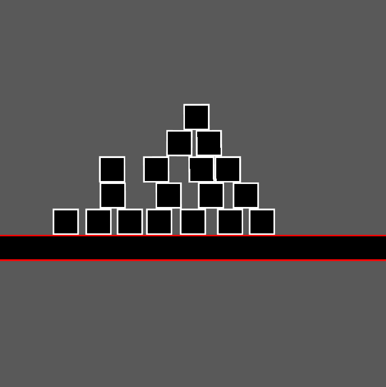

# Bolt Engine
Gameengine (in development)

## Screenshots

  
  

## External Libraries / API's
- OpenGL - Rendering API
- STB - Graphics Image Library
- GLM - Graphics Math Library
- GLFW - Window Library
- Box2D - 2D Physics Library/Engine
- Cereal - Serialization Library
- ENTT - ECS Library
- Miniaudio - Multiplatform Audio Library
