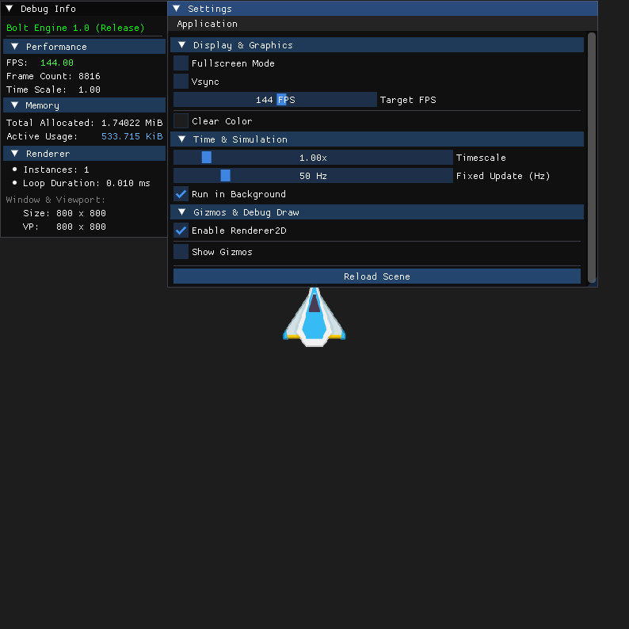
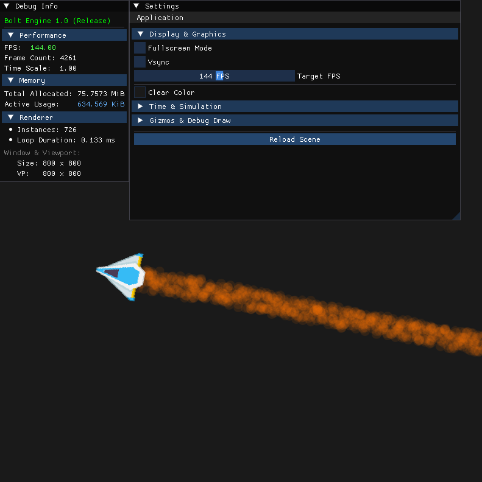
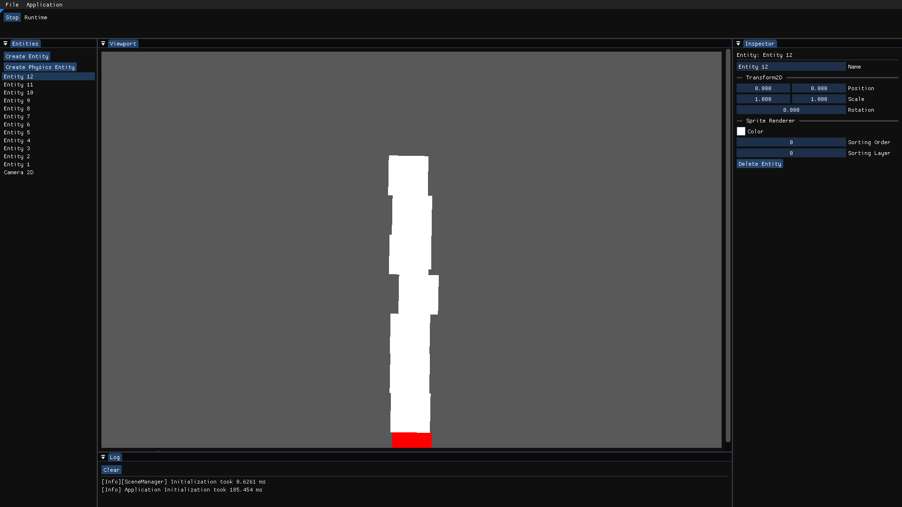

# Bolt
Windows (only) Compatible 2D Game-Engine written in C++

## Preview

### Game

<p align="center">
  
  
</p>

---

### Editor

<p align="center">
  
</p>

## External Libraries / API's
- [Bolt-Physics2D](https://github.com/Ben-Scr/Bolt-Physics2D) - Lightweight 2D Physics Library
- [OpenGL](https://www.opengl.org/) - Rendering API
- [STB](https://github.com/nothings/stb) - Graphics Image Library
- [GLM](https://github.com/g-truc/glm) - Graphics Math Library
- [GLFW](https://github.com/glfw/glfw) - Window Library
- [Box2D](https://github.com/erincatto/box2d) - 2D Physics Library
- [ENTT](https://github.com/skypjack/entt) - ECS Library
- [Miniaudio](https://github.com/mackron/miniaudio) - Multiplatform Audio Library

## Usage
- Basic 2D Rendering
- Game Development

## How to Build
### Premake + Visual Studio 2022 (primary)
1. Ensure Python 3 is installed and available on `PATH`.
2. Ensure Premake is available at:
   `vendor/bin/premake5.exe`
3. Run setup from Windows:
   ```bat
   scripts\Setup.bat
   ```
   This setup flow will:
   - update submodules (`git submodule update --init --recursive`)
   - attempt `git lfs pull`
   - generate Visual Studio 2022 files using Premake
4. Open the generated `Bolt.sln` in Visual Studio 2022.
5. Select `Debug|x64` (or `Release|x64` / `Dist|x64`) and build.

Projects generated in the workspace:
- `Bolt-Engine`
- `Bolt-Editor`
- `Bolt-Runtime`
- `ImGui`

Runtime assets are copied to the runtime output directory after build.

### CMake (legacy / transition)
The existing CMake files are still present during the migration period, but Premake is now the preferred workflow.
